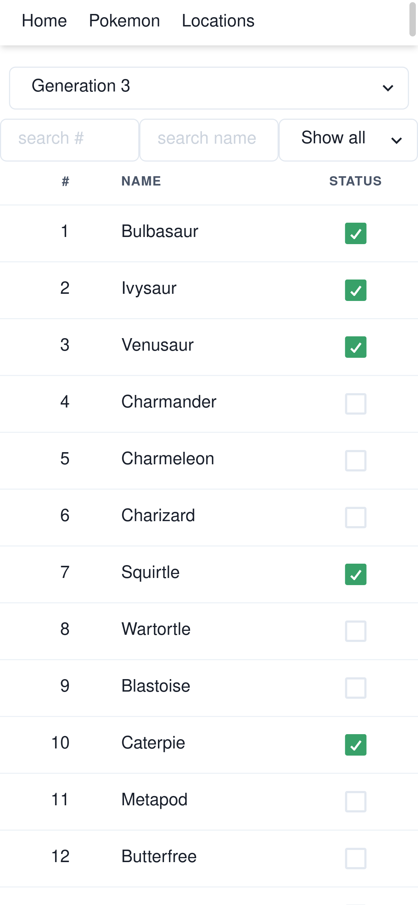
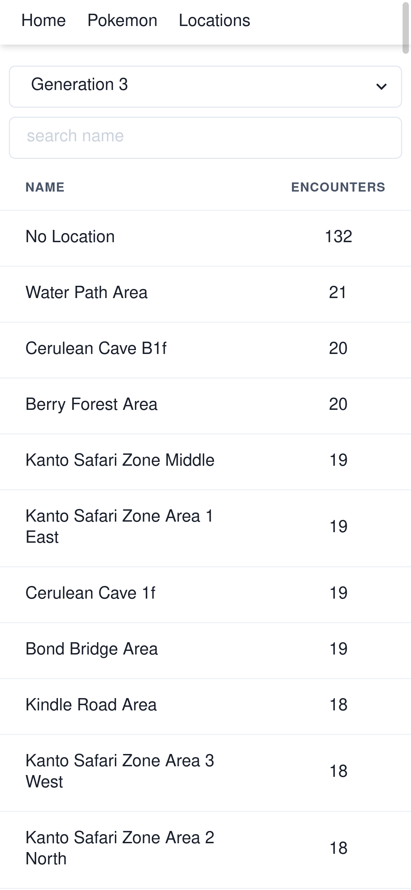
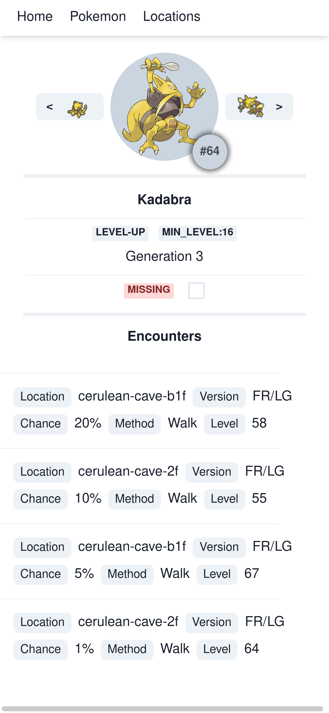
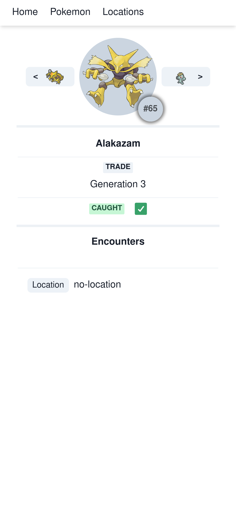
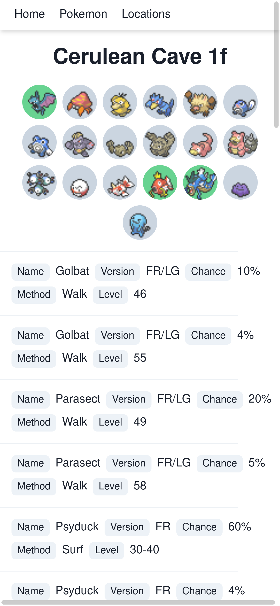
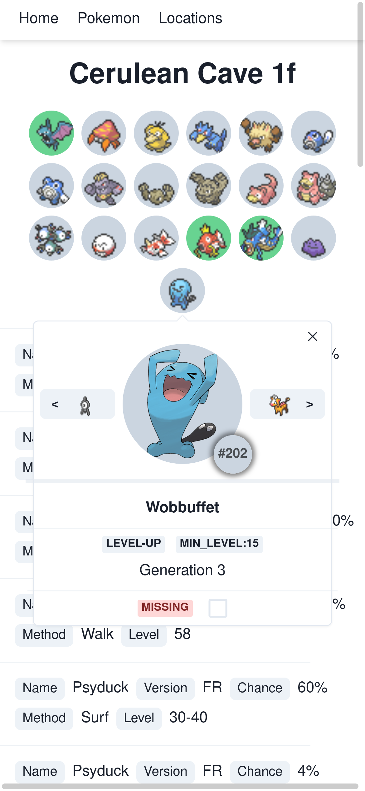

# Pokemon Catching Guide Website

Pokemon Catching Guide Website is a simple web application built with React and TypeScript. It allows the user to view all video game encounters and mark them as caught (generation 1-6 currently supported).

It is best viewed on a mobile device (works great on Iphone 13 Pro). My main use case for this website is to view on a phone without the need for a PC so I did not bother optimizing it for desktop usage. It works, but it's not super pretty. :)

It serves data from the REST API located in the repository [Pokemon Catching Guide API](https://github.com/peroxy/pokemon-catch-guide-api).

## Installation

Use the package manager [npm](https://www.npmjs.com/) to install the components required for running website.

```bash
cd pokemon-catch-guide-website
npm install
```

You will also need to run the pokemon-catching-guide-api before running this project:

```bash
cd pokemon-catch-guide-api
npm install
npm run start  
# or `npm run live-reload` if you are developing 
```

## Usage

Open `http://localhost:3000` after running the application.

## Screenshots

<details>
    <summary>Home page with a list of all Pokemon</summary>



</details>

<details>
    <summary>List of all locations</summary>



</details>

<details>
    <summary>Selected Pokemon</summary>




</details>

<details>
    <summary>Location with encounters</summary>




</details>


## Contributing
Pull requests are welcome. For major changes, please open an issue first to discuss what you would like to change.

Please make sure to update tests as appropriate.

## License
[Apache License 2.0](http://www.apache.org/licenses/)